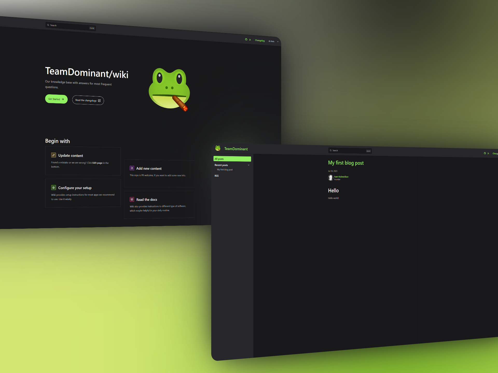

<div align="center">
   <a href="https://wiki.amdcloud.kz">
     
  </a>

  <h1 align="center">TeamDominant/wiki</h3>

  <p align="center">
    Our knowledge base with answers for most frequent questions.
    <br />
    <p align="center">
    <a href="https://wiki.amdcloud.kz">
        
    </a>
    </p>
    <a href="https://github.com/TeamDominant/wiki/releases">
      
    </a>
    <a href="https://github.com/TeamDominant/wiki/actions/workflows/deploy.yml">
      
    </a>

  </p>
</div>

<p align="center">
    <a href="https://wiki.amdcloud.kz" target="_blank" rel="noopener noreferrer" >
        
    </a>
</p>

<h1 align="center"></h3>

<details>
<summary>Starlight README.md</summary>

## Starlight Starter Kit: Basics

[](https://starlight.astro.build)

```
npm create astro@latest -- --template starlight
```

[](https://stackblitz.com/github/withastro/starlight/tree/main/examples/basics)
[](https://codesandbox.io/p/sandbox/github/withastro/starlight/tree/main/examples/basics)
[](https://app.netlify.com/start/deploy?repository=https://github.com/withastro/starlight&create_from_path=examples/basics)
[](https://vercel.com/new/clone?repository-url=https%3A%2F%2Fgithub.com%2Fwithastro%2Fstarlight%2Ftree%2Fmain%2Fexamples%2Fbasics&project-name=my-starlight-docs&repository-name=my-starlight-docs)

> 🧑‍🚀 **Seasoned astronaut?** Delete this file. Have fun!

## 🚀 Project Structure

Inside of your Astro + Starlight project, you'll see the following folders and files:

```
.
├── public/
├── src/
│   ├── assets/
│   ├── content/
│   │   ├── docs/
│   └── content.config.ts
├── astro.config.mjs
├── package.json
└── tsconfig.json
```

Starlight looks for `.md` or `.mdx` files in the `src/content/docs/` directory. Each file is exposed as a route based on its file name.

Images can be added to `src/assets/` and embedded in Markdown with a relative link.

Static assets, like favicons, can be placed in the `public/` directory.

## 🧞 Commands

All commands are run from the root of the project, from a terminal:

| Command                   | Action                                           |
| :------------------------ | :----------------------------------------------- |
| `npm install`             | Installs dependencies                            |
| `npm run dev`             | Starts local dev server at `localhost:4321`      |
| `npm run build`           | Build your production site to `./dist/`          |
| `npm run preview`         | Preview your build locally, before deploying     |
| `npm run astro ...`       | Run CLI commands like `astro add`, `astro check` |
| `npm run astro -- --help` | Get help using the Astro CLI                     |

## 👀 Want to learn more?

Check out [Starlight’s docs](https://starlight.astro.build/), read [the Astro documentation](https://docs.astro.build), or jump into the [Astro Discord server](https://astro.build/chat).

</details>

<details>
<summary>Credits</summary>

- [remnawave/panel README.md](https://github.com/remnawave/panel/blob/main/README.md)
- [kutovoys/xray-checker docs](https://github.com/kutovoys/xray-checker/tree/main/docs)
- [quietsy/advanced-configurations docs](https://github.com/quietsy/advanced-configurations/tree/master/docs)

</details>