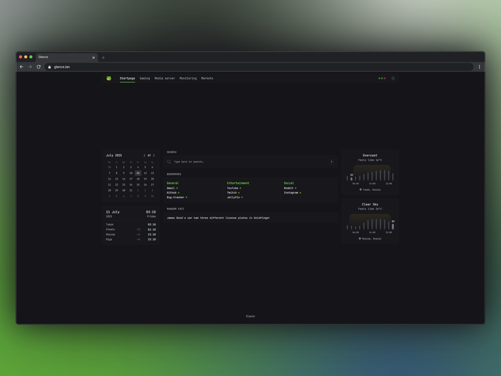
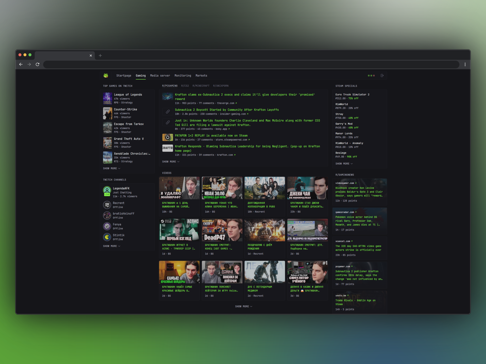
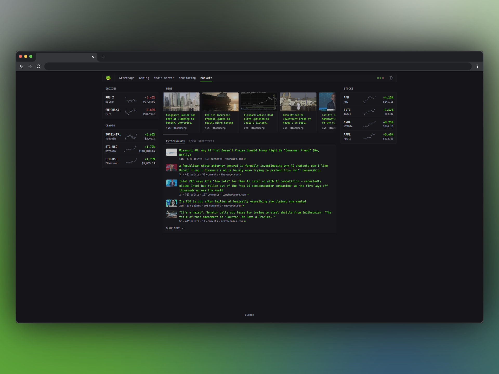
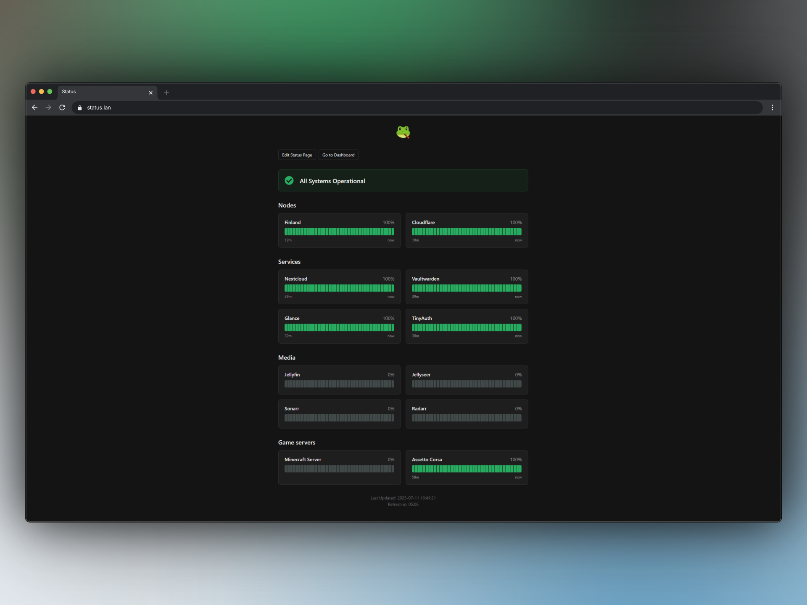
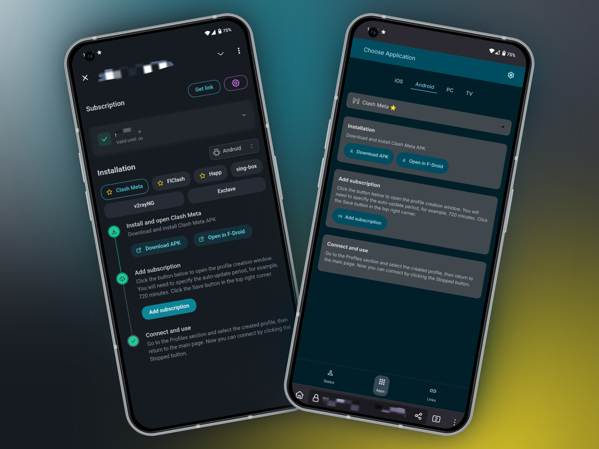
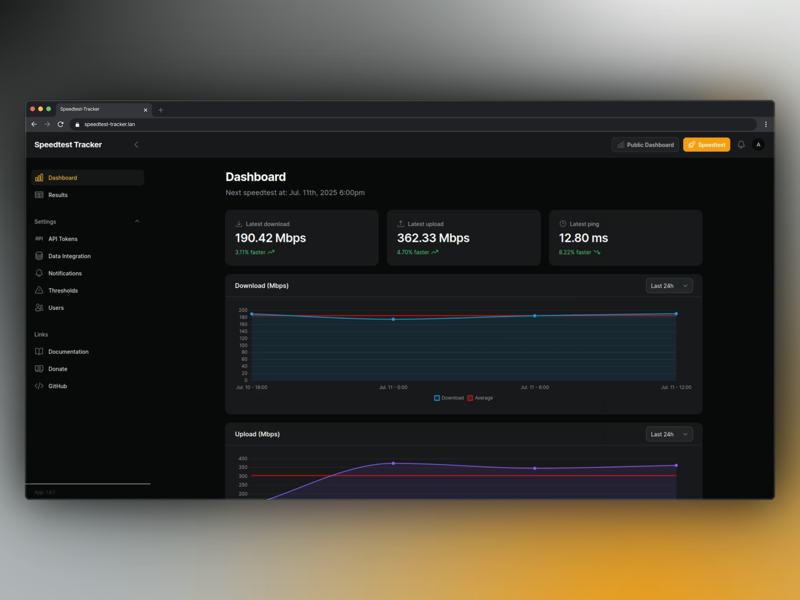
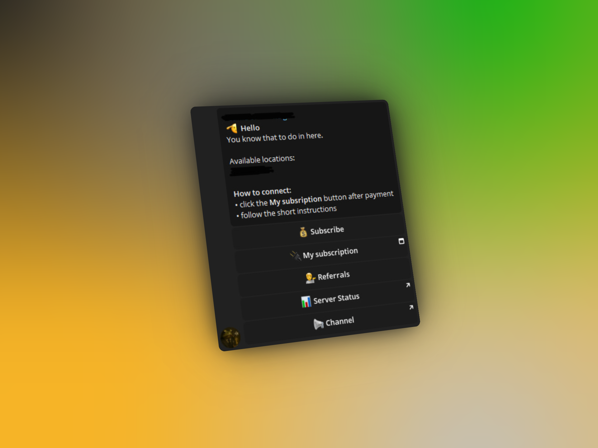
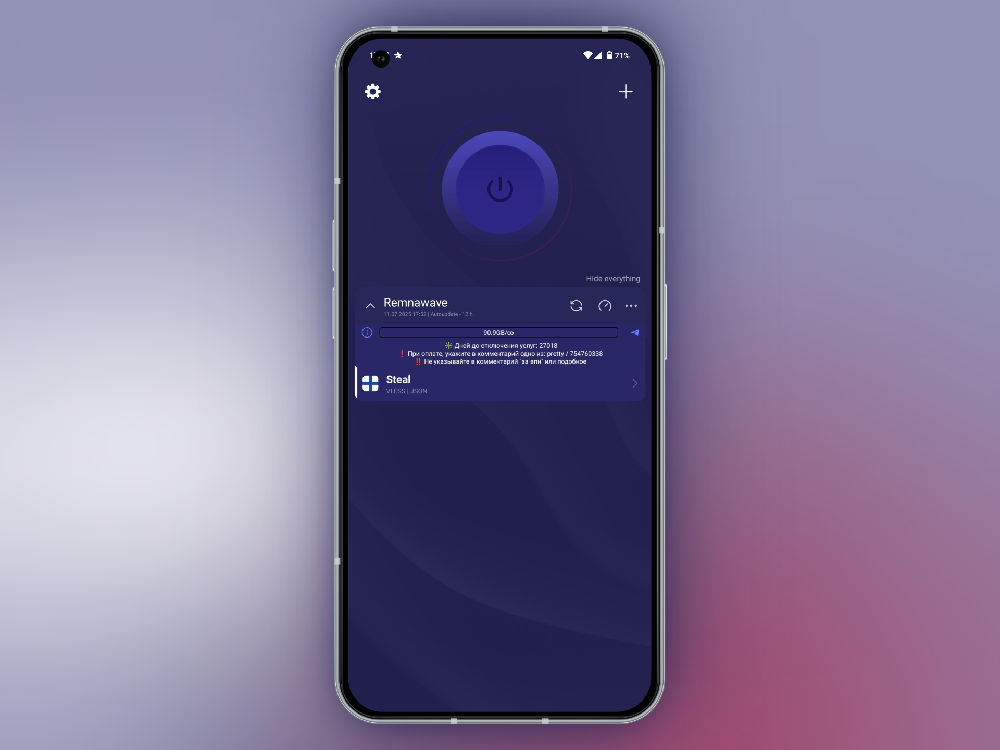
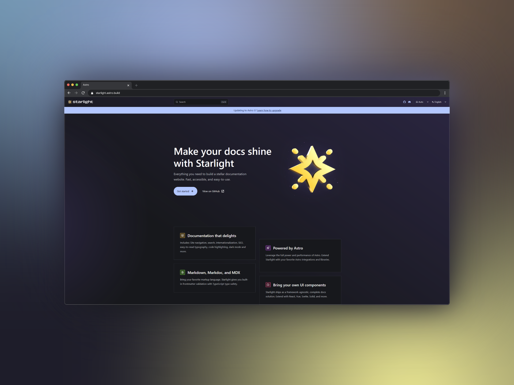
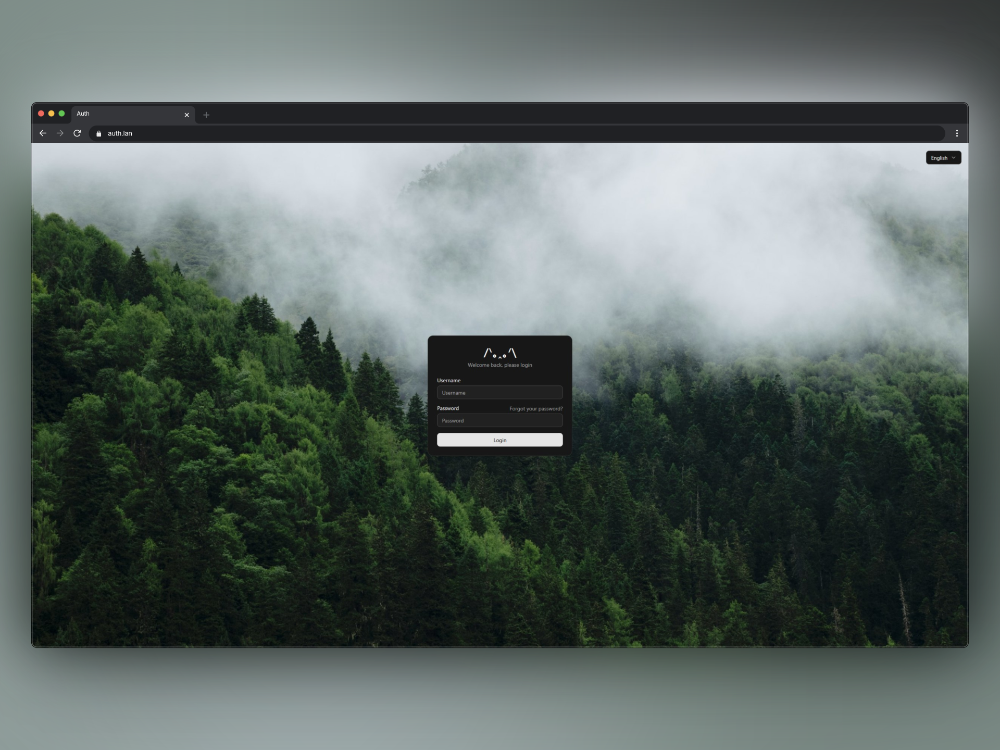

## Introduction

After almost a half of year of silence we are ready to save in timeline what was changed.

## Added

### Homepage

Previously, we were self-hosting [gethomepage](https://gethomepage.dev/) container, which was pretty enough for all that time and I honestly like it, but it overgrew into something problematic..maybe it was due to lack of knowledge.  
Whatever, as it got replaced with different homepage container — [Glance](https://github.com/glanceapp/glance)...  
<!-- excerpt -->

Right after a successful login, which is required __only once__, user can navigate between tabs of different categories, such as:

- Startpage, which can be used at New tab homepage (e.g. Zen, [click to view instructions](/changelog/long-awaited-v20/#betterzen-and-glance-integration)) as there are widgets like searchbar, weather, timezones and etc.

- Gaming, which contains most used features including as Top Categories on Twitch, Streamers, which are streaming at the moment, recent youtube videos, recent reddit game communities posts, steam sales.

- Media server, shows all info about Jellyfin, Jellyseer and other Arr containers.
- Monitoring, will be useful only for maintainers, because it shows recent Github releases, Netbird peers status, server stats, uptime-kuma monitors and speedtest-tracker.
- Market, contains Euro -> Ruble and Dollar -> Ruble indices, Crypto -> Dollar, Stocks and news about what happens in the world.

:::tip[Where can I get my credentials?]
It is 99,9% chance, that you can here from our Telegram chat, so whether ask in chat or in my DMs.
:::

### Status page

After plenty of back-and-forth — especially during unexpected service downtimes — we are finally introducing a monitoring service.

  

As the title says, we finally can monitor the services status without struggling and waiting for an answer in chat each time.

### Subscription page

The old subscription page has been fully replaced with a new one created by [legiz-ru](https://github.com/legiz-ru/material-remnawave-subscription-page).  
It not only looks better, but also provides new type of device — TV.

### Speedtest-tracker

We already [mentioned](/changelog/long-awaited-v20/#homepage) speedtest-tracker, but can't to not mention it once again.

The test runs every 6 hours, so we can better understand how it goes on our servers.  
Also, speedtest-tracker widget is created by Glance community and added to our homepage in order to monitor it without need to visit container page.

### Telegram bot

Created a telegram bot with mini-app, so users can interact with their subscriptions without need to contact the owner.  

:::tip
Recommended payment method is **Tribute**.
:::

## Updated

### Re-branding

Most of services got re-branding, you could notice it by visiting our services and telegram chats/bots.

### Nginx & Xray configurations

Since we had no time to update configurations they became outdated.  
Configurations were updated, everyone noticed it because services went down for some hours.

### Happ Announce

Happ announce on main page was updated for better understanding, providing more useful info and just looks better now.

### BetterZen and Glance integration

Our [Betterfox fork](https://github.com/TeamDominant/Betterfox) got updated with Zen-browser tweaks. Please, read updated [instructions](https://github.com/TeamDominant/Betterfox/blob/main/README.md) how to install BetterZen.

1. Right after installation you need to download additional extension. [Click me to download](https://addons.mozilla.org/firefox/downloads/file/4270256/new_tab_homepage-0.6.3resigned1.xpi).

2. Navigate to [about:config](about:config) and change `zen.urlbar.replace-newtab` to `false`

3. Go to [about:preferences#home](about:preferences#home), change **Homepage and new windows** to `Custom URLs` & enter homepage URL and **New tabs** to `New tab homepage`.

Now you can experience our new homepage everytime you open new tab or window.

### Status page

On the bottom of page you can now see when exactly stats were refreshed and when it will be refresh again.
See [Status page update](/changelog/long-awaited-v20/#status-page) for more info

### Nextcloud

We didn't update Nextcloud and its stack for awhile, so its time to.

Stack was updated with:

- Notification push service
- Collabora (Lumetis only as a test)
- Imaginary
- Draw.io (Lumetis only as a test)

We actually wanted to add a new container — [Immich](https://github.com/immich-app/immich), but didn't want to break someone's database in order to intergate Immich with Nextcloud Photos.  
So, now Photos tab's performance got tweaked very well. Remember photos and videos couldn't get a preview and fast load? Forget it.

### Wiki

After a long fighting with Mkdocs Material, we couldn't get used to it. Due to personal preferences and lack of time we are migraing our Wiki to [Starlight developed by Astro](https://starlight.astro.build/)!

:::caution
The contents of Wiki are still under re-write. Please, be patient. PR Welcome.
:::

## Removed

### Pairdrop

Pairdrop was removed, because there was no sense of hosting it as there is a better analog like [LocalSend](https://github.com/localsend/localsend).

### Privatebin

Privatebin was removed, because there was no sense of hosting it as there is no difference between the official instance. So, please, use [official website](https://privatebin.net/) or use Flowseal's self-hosted [Wastebin](https://wastebin.flowseal.ru/).

### Neko dashboard

We removed interactive web page to control Neko Discord bot, because it was laggy and buggy. The better way is using commands.

Bot invite [link](https://discord.com/oauth2/authorize?client_id=977082782641700904&scope=bot&permissions=0).

## Coming soon

### Jellyfin

We need a little more time for it to finally introduce it to our users.

### Minecraft

The server is mostly ready, we are just struggling with modpack.

### Migration of frontend

The way of how we use it right now is [not documentated](https://remna.st/docs/overview/quick-start) and overall it is recommended to use panel and node on different servers, so we need to figure this out. Migration will be announced.

## For maintainers 

:::note
This part is mostly related to maintainers team.
:::

### Authentication

Second layer of auth was added to some of our services.  
Services with such auth are supposed to be accessed only by maintainers / personal service.

### Firehol

Firehol blocklists are a collection of automatically updating ipsets from all available security IP Feeds, mainly related to on-line attacks, on-line service abuse, malwares, botnets, command and control servers and other cybercrime activities.  
We found it really useful, thanks quietsy for posting such useful guides on his documentation repository.

Rules were added to servers and also updated with additional one.

### Netbird

Servers are now connected with netbird peers in order to communicate by using ports which are restricted by Roscomnadzor.  
Added Glance widget for better monitoring.